# Browser Technologies Opdracht 2
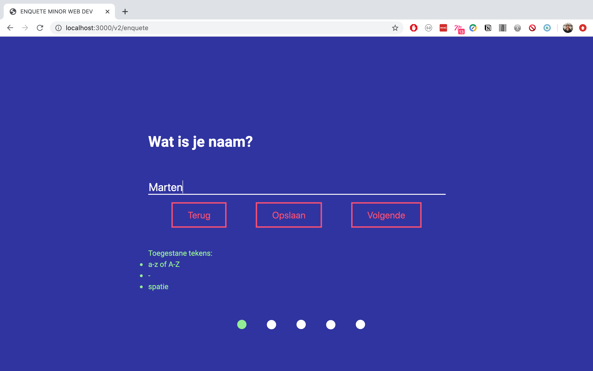

<details><summary>Screenshot orgineel</summary>

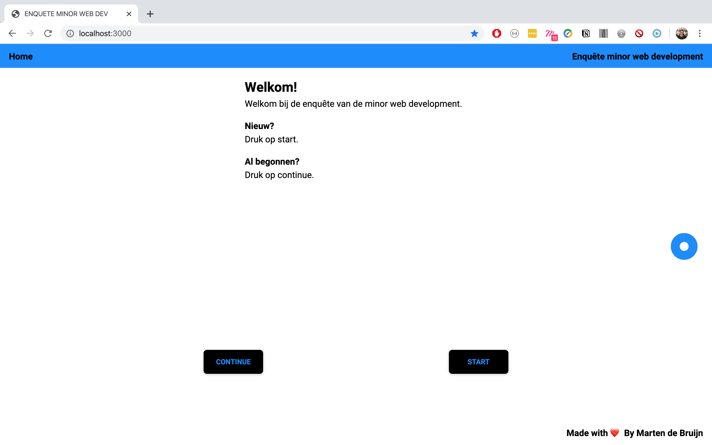
</details>

## 👾 Introductie

Korte enquête voor de minor web development met de mogelijkheid om verder te gaan waar men gebleven was. Op basis van Progressive Enhancement en Feature Detection. Zie de wiki voor uitgebreidere uitleg.

## ✏️ Concept
### Use Case

> Ik wil een enquete kunnen invullen over de minor Web Development, met verschillende antwoord mogelijkheden. Als ik de enquete niet afkrijg, wil ik later weer verder gaan met waar ik ben gebleven.

### Core Functionaliteit
De core functionaliteit van de app is het kunnen invullen van de enquête en het bewaren van de antwoorden zodat de gebruiker terug kan gaan en verder kan gaan waar hij gebleven is.

<details><summary>Mobile schets</summary>

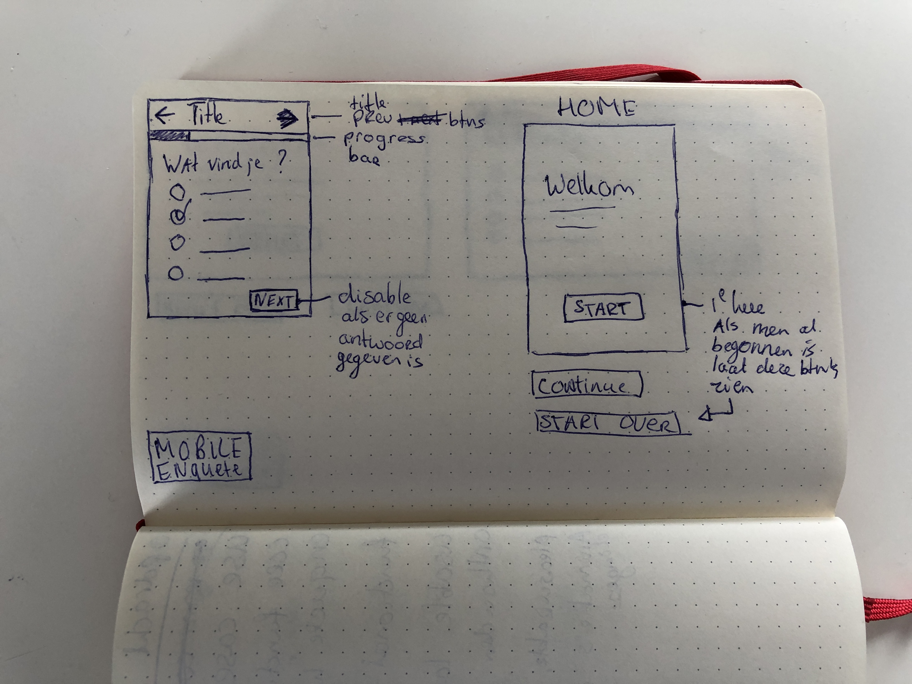
</details>
<details><summary>Desktop schets</summary>

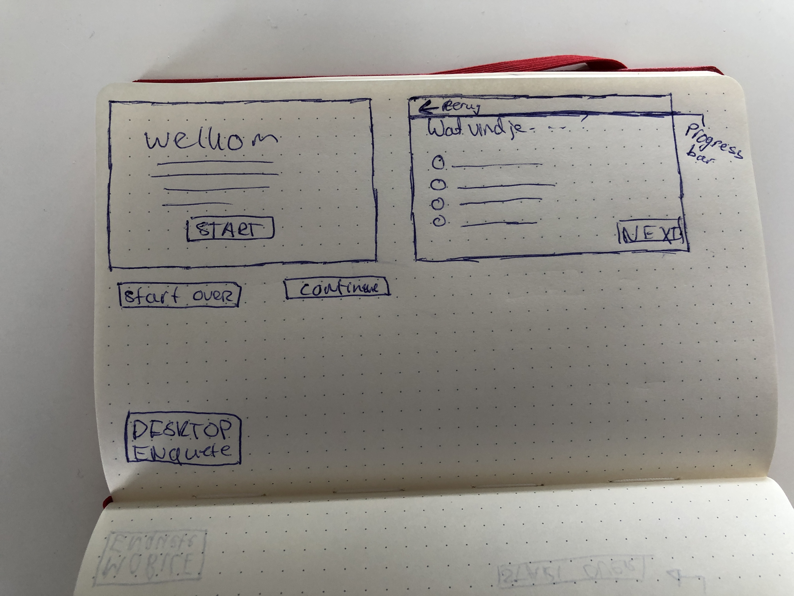
</details>

#

### Input types used
<details><summary>text</summary>


</details>
<details><summary>radio</summary>

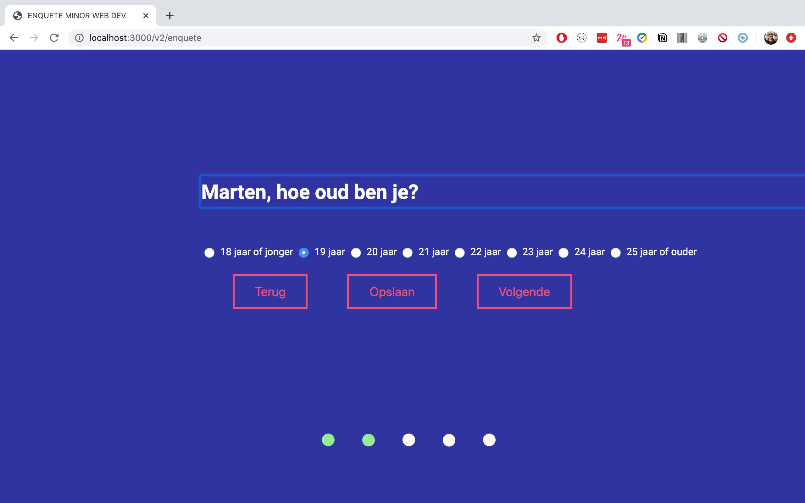
</details>
<details><summary>range</summary>

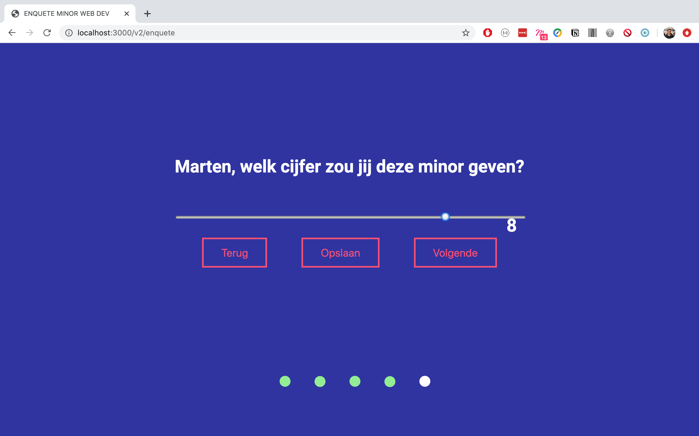
</details>
<details><summary>color</summary>

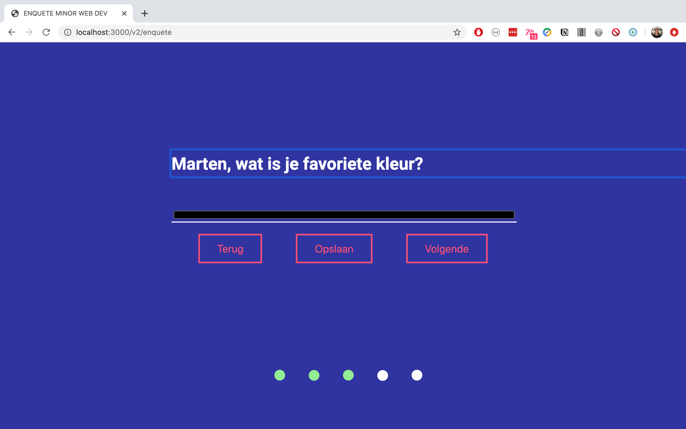
</details>
<details><summary>select</summary>

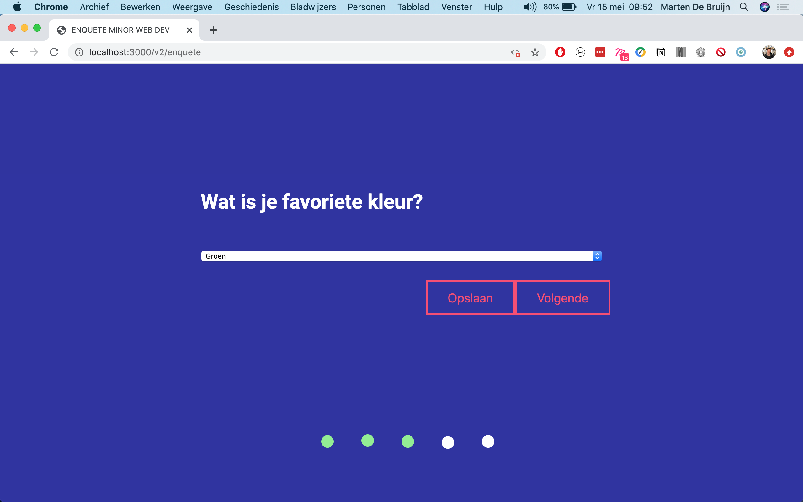
</details>
<details><summary>date</summary>


</details>

#

### Aanvulling
Bij de aanvulling heb ik ervoor gekozen om meer de focus te leggen op de vragen. Hierom geef ik (met CSS) één vraag weer, groot, in het midden van het scherm.

<details><summary>Screenshot</summary>


</details>

## 🕹 Live Demo

[Bekijk hier de live demo 😃](https://enquete-minor-webdev.herokuapp.com/)

## 👨‍🦯 Usage

```zsh
git clone https://github.com/martendebruijn/Browser-Technologies-Opdracht-2.git
cd browser-technologies-opdracht-2
npm install
npm start
```

## 📍 Table of Contents

- [🧙‍♂️ Progressive Enhancements](#%EF%B8%8F-progressive-enhancements)
- [🔍 Feature Detection](#-feature-detection)
- [👨‍🦽 Accessibility](#-accessibility)
- [💈 Conclusie](#-conclusie)
- [✨ Whishlist](#-Whishlist)
- [🙌 Credits](#-Credits)
- [📚 Sources](#-Sources)

## 🧙‍♂️ Progressive Enhancements

<details><summary>Functional Layer</summary>
Alleen HTML.

- alle vragen als geheel weergeven
- antwoorden opslaan via url query

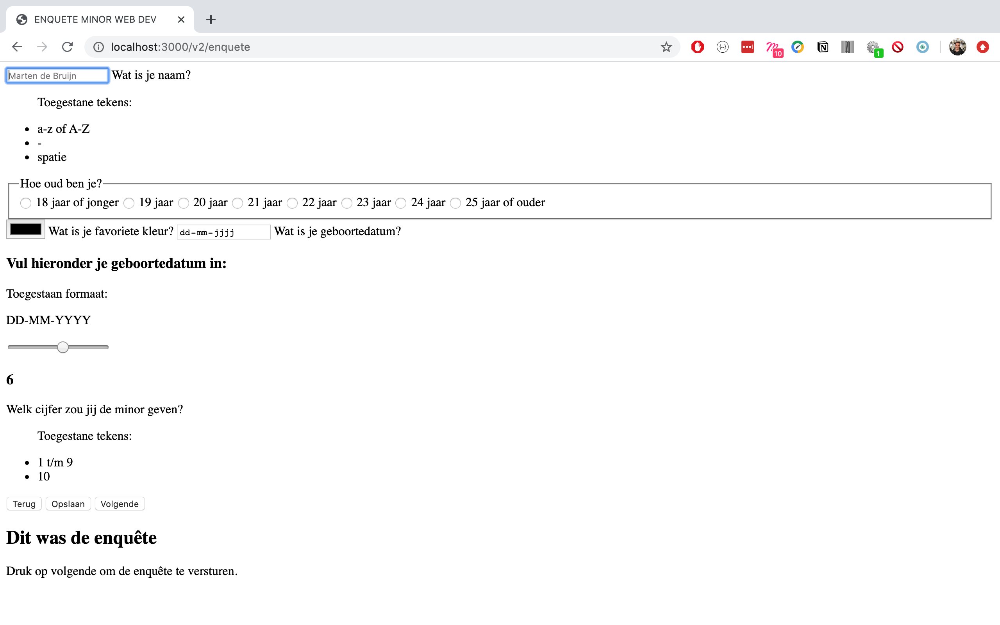
</details>
<details><summary>Usable Layer</summary>
HTML en CSS.

- één vraag tegelijk
- validatie feedback
- navigeermogelijkheid

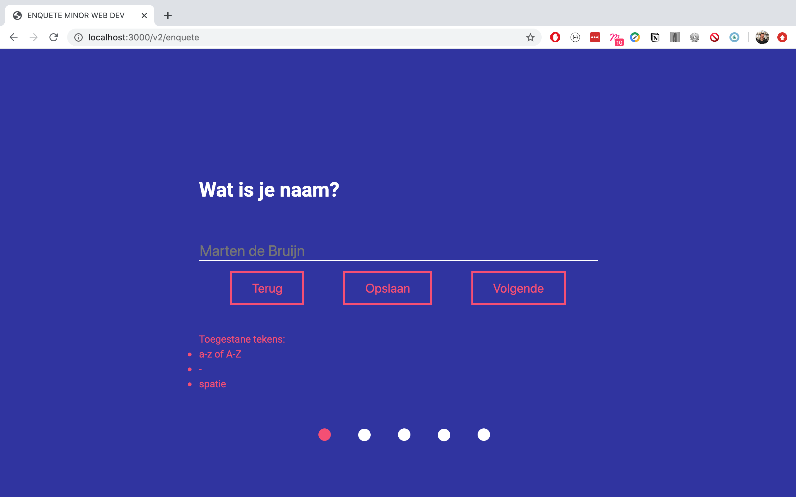
</details>
<details><summary>Pleasurable Layer</summary>
HTML, CSS en JavaScript.

- antwoorden automatisch opslaan met LocalStorage
- vragen worden aangepast aan de naam en geboortejaar
- enter toets toevoeging
- terug knop
- indien mogelijk input type date
- indien mogelijk input type range
- indien mogelijk input type color

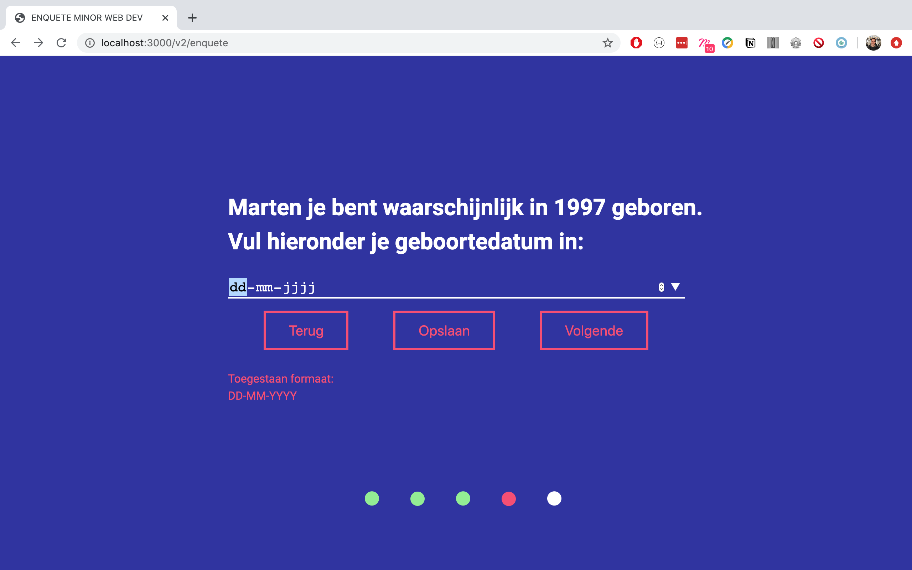
</details>

#

### Orginele versie
<details><summary>CSS Selectors</summary>

## :read-only

`:read-only` en `:read-write` worden over het algemeen goed ondersteund, bij Firefox, Firefox for Android en KaiOS Browser moet men de prefix `-moz-` gebruiken.

```css
input:-moz-read-only {
  background-color: #ccc;
}
```

## Toepassing

```css
input:read-only {
  border-bottom: none;
}
input:-moz-read-only {
  border-bottom: none;
}
```

Bovenstaand moet onder alle form validatie styling staan, zodat de code aan het begin geen border krijgt.

```css
input[type='text']:invalid:not(:placeholder-shown) {
  border-bottom: 2px solid red;
}
```

Bovenstaand moet dus voor de `:read-only` staan.

###### Sources

1. [Can I Use - :read-only](https://caniuse.com/#search=read-only)
1. [:read-only - MDN](https://developer.mozilla.org/en-US/docs/Web/CSS/:read-only)

## :placeholder-shown

Wordt bij IE ondersteund door `:-ms-input-placeholder` te gebruiken.

###### Sources

1. [Can I Use - :placeholder-shown](https://caniuse.com/#search=%3Aplaceholder-shown)

</details>
<details><summary>CSS Flexbox</summary>

## display: flex

`display: flex` wordt door vrijwel alle browsers ondersteund. IE gebruikt `-ms-flexbox`.

## flex-wrap

Wordt ondersteund door vrijwel alle grote browsers.

## flex-direction

Flex-direction wordt vrijwel door alle grote browsers ondersteund. Bij Firefox en Firefox voor Android is het niet ondersteund bij default. Voor Firefox moet de `-moz-` prefix gebruikt worden.
`-moz-box-direction:`

## align-items

Wordt door alle grote browsers ondersteund behalve IE 11.

## justify-content

Wordt door alle grote browsers ondersteund behalve IE 11. Bij UC Browser for Android, QQ Browser en KaiOS Browser wordt justify-content wél ondersteund bij CSS-grid, maar niet bij flexbox.

## align-self

Wordt door vrijwel alle grote browser ondersteund. IE10 en IE11 heeft de property `-ms-grid-column-align` wat hetzelfde doet als `align-self`.

###### Sources

1. [Can I Use - display: flex](https://caniuse.com/#search=display%3A%20flex)
1. [Can I Use - flex-wrap](https://caniuse.com/#search=flex-wrap)
1. [Can I Use - flex-direction](https://caniuse.com/#search=flex-direction)
1. [Can I Use - align-items](https://caniuse.com/#search=align-items)
1. [Can I Use - justify-content](https://caniuse.com/#search=justify-content)
1. [Can I Use - align-self](https://caniuse.com/#search=align-self)
</details>

<details><summary>Progress Bar</summary>

Als de gebruiker CSS heeft ingeladen wordt er een voortgangs balk zichtbaar.

```css
.progress-bar {
  height: 20px;
  width: 100%;
  background: white;
  border-radius: 6px;
  overflow: hidden;
}
.progress-v1,
.progress-v2,
.progress-v3,
.progress-v4,
.progress-v5,
.progress-v6,
.progress-v7 {
  background: #4caf50;
  height: 100%;
}
.progress-v1 {
  width: calc(100% / 7);
}
.progress-v2 {
  width: calc(calc(100% / 7) * 2);
}
.progress-v3 {
  width: calc(calc(100% / 7) * 3);
}
.progress-v4 {
  width: calc(calc(100% / 7) * 4);
}
.progress-v5 {
  width: calc(calc(100% / 7) * 5);
}
.progress-v6 {
  width: calc(calc(100% / 7) * 6);
}
.progress-v7 {
  width: 100%;
}
```
</details>
<details><summary>CSS Checkbox Hack</summary>

> ❗️Ik gebruikte de checkbox hack om de radio buttons te stylen. Echter kan men dan niet meer de radio buttons selecteren d.m.v. keyboard navigatie. Om deze reden heb ik de checkbox hack eruit gehaald.

Wanneer de gebruiker de mogelijkheid heeft om CSS in te laden, kunnen we d.m.v de checkbox hack zorgen dat de gebruiker niet de native, maar de custom checkboxen en radio buttons ziet.

```css
input[type='radio'] {
  display: none;
}
fieldset label:before {
  content: '';
  border: 2px solid gray;
  width: 10px;
  height: 10px;
  border-radius: 50%;
  margin-right: 1em;
}
input[type='radio']:checked + label:before {
  background: green;
}
```
</details>

<details><summary>Overig CSS</summary>

## Transition

Wordt ondersteund door alle grote browsers (zelfs IE 10 :-)).

###### Sources

1. [Can I Use - Transition](https://caniuse.com/#search=transition)

## Appearance

`appearance` wordt gesupport met `none` maar niet `auto`. Microsoft Edge en IE Mobile supporten het met `-webkit-` en **niet** `-ms-`.

Ik gebruik alleen `appearance: none` dus geen support voor `auto` is prima.

###### Sources

1. [Can I Use - Appearance](https://caniuse.com/#search=appearance)

## Box-shadow

`box-shadow` wordt gesupport. Om `box-shadow` te gebruiken voor IE 9 of later, moet men `border-collapse` de waarde `seperate` geven. `inset` shadow moet het laatste keyword zijn.

###### Sources

1. [Can I Use - box-shadow](https://caniuse.com/#search=box-shadow)

## calc()

Wordt ondersteund. IE 11 heeft problemen met:
- IE & Edge are reported to not support calc inside a 'flex'. (Not tested on older versions)
This example does not work: flex: 1 1 calc(50% - 20px);

- IE11 does not support transitioning values set with calc()
- IE11 is reported to have trouble with calc() with nested expressions, e.g. width: calc((100% - 10px) / 3); (i.e. it rounds differently)
- IE11 is reported to not support calc() correctly in generated content
- IE10, IE11, and Edge < 14 don't support using calc() inside a transform. Bug report
- IE 9 - 11 don't render box-shadow when calc() is used for any of the values
  -IE10 crashes when a div with a property using calc() has a child with same property with inherit.
- IE 9 - 11 and Edge do not support width: calc() on table cells. Bug Report

Maar bovenstaand gebruik ik niet. Ik gebruik wel nested expressions maar niet als bovenstaand `width: calc((100% - 10px) / 3);`, maar als `width: calc( calc( 100% / 7 ) * 2);`. Welk effect dit heeft weet ik niet, dit zou ik moeten testen op IE11, maar ik ben momenteel niet in staat om op IE11 te testen.

###### Sources

1. [Can I Use - Calc()](https://caniuse.com/#search=calc)
</details>
<details><summary>Data opslaan op de server</summary>

Het opslaan op de server was mij wel gelukt, maar op begeven moment was het een erg lang en ingewikkeld stuk code. Ook was ik hier veel te lang meebezig terwijl dit niet onderdeel is van de opdracht. Hierom heb ik op gegeven moment besloten om [deze code](https://github.com/Choerd/browser-technologies-1920.git) te gebruiken. Op basis van deze code heb ik verder gewerkt. In deze code krijgt de gebruiker een persoonlijke code, waarmee hij vervolgens later kan verder gaan met de enquête. Ik heb vervolgens zelf een terug knop erin gebouwd, waarmee de gebruiker terug kan gaan naar vorige vragen waar zijn gegeven antwoord nog/weer staat. Ook heb ik de persoonlijke code op iedere pagina laten weergeven en ook in de url gezet.

```js
function checkAnswer(userid, name, route, res) {
  const json = readFromJson();
  const user = json.find(user => user.id === userid);
  const index = json.map(o => o.id).indexOf(user.id);
  const data = json[index];
  const vraagObj = data[name];
  let answer = '';
  let answerReversed = answer;
  if (vraagObj) {
    const objKeys = Object.keys(vraagObj);
    const key = objKeys[0];
    answer = vraagObj[key];
    if (key === 'verjaardag') {
      answerReversed = checkDateFormat(answer);
    }
  }

  res.render(route, {
    userid: userid,
    style: './../css/styles.css',
    script: './../js/main.js',
    answer,
    answerReversed,
  });
}
```

Met bovenstaande code controleer ik of er al een antwoord is gegeven. Als dit het geval is, wordt deze in de input elementen geladen.
D.m.v.:

```html
value="<%= answer %>"

<!-- Radio buttons: -->
<% if(answer === '18 of jonger') {%>
<input
  id="18"
  type="radio"
  name="leeftijd"
  value="18 of jonger"
  required
  checked
/><label for="18">18 of jonger</label>
<% } else { %>
<input
  id="18"
  type="radio"
  name="leeftijd"
  value="18 of jonger"
  required
/><label for="18">18 of jonger</label> <% } %>
<!-- ... etc. -->
```

Bij de geboortedatum moeten we een extra check doen. Wanneer input type date niet wordt ondersteund, wordt er een input type text weergegeven. Hier laat ik de gebruiker zijn geboortedatum invullen als `DD-MM-YYYY`. Dit doe ik omdat dat de manier is hoe wij hier - in Nederland - data noteren. Echter vereist input date een datum notatie van `YYYY-MM-DD`. Als de gebruiker wilt verder gaan met de enquête op een browser die input type date wél ondersteund, maar hiervoor zijn geboortedatum ingevuld heeft in een input type text element, moeten we deze datum dus eerst omdraaien.

1. Allereerst checken we of het om het geboortedatum element gaat.

```js
if (key === 'verjaardag') {
  answerReversed = checkDateFormat(answer);
}
```

2. Vervolgens controleren we of de datum notatie valide is of niet.
3. Als deze niet valide is splitsen we de datum bij de koppeltekens.
4. Draaien we deze om.
5. En zetten we de koppeltekens weer terug.

```js
function checkDateFormat(date) {
  const pattern = /[0-9]{4}.(0[1-9]|1[012]).(0[1-9]|1[0-9]|2[0-9]|3[01])/g;
  const valid = pattern.test(date);
  if (!valid) {
    const splitStr = date.split('-');
    const reverseArr = splitStr.reverse();
    const joinArr = reverseArr.join('-');
    date = joinArr;
  }
  return date;
}
```

6. De reversed waarde bewaren we in een `hidden` element op de pagina, zodat we deze kunnen aanroepen in de client-side JavaScript - input type date wordt pas in de client-side JavaScript in de DOM gezet. Hierdoor kunnen we niet `<%= answerReversed %>` gebruiken.

```html
<p id="js-date-answer" hidden><%= answerReversed %></p>
```

7. In de `addDateInput` functie halen we de omgedraaide waarde weer terug en zetten we deze in het input type date element.

```js
function addDateInput() {
  if (checkDateInput()) {
    const el = document.getElementById('js-date');
    const answerEl = document.getElementById('js-date-answer');
    const answer = answerEl.innerText;
    el.innerHTML = `<input type="date" name="verjaardag" required max="2002-01-01" value="${answer}">`;
  }
}
```

###### Sources

1. [Persoonlijke 'code' code](https://github.com/Choerd/browser-technologies-1920.git)
</details>

<details><summary>Thema chooser</summary>

## CSS

Het standaard thema is het dark thema. Hier maak ik gebruik van custom properties. Het standaard thema heeft fallback kleuren in de CSS. Door gebruik te maken van cascading wordt in onderstaande code de achtergrond black, en wanneer custom properties worden ondersteund, wordt de achtergrond kleur de kleur die de `theme-color` variable is.

```css
background: black; /* fallback */
background: var(--theme-color);
```

Alle browsers die de mediaquery `prefers-color-scheme` ondersteunen, ondersteunen custom properties ook. Hierom hoeft men hier geen gebruik te maken van fallback kleuren.

```css
:root {
  --warning: #ff5c5c;
  --theme-color: black;
  --theme-color-secundair: white;
  --theme-color-accent: #1089ff;
  --focus-color: blue;
  --succes: #4caf50;
  --grey: grey;
}
@media (prefers-color-scheme: light) {
  :root {
    --warning: #ff5c5c;
    --theme-color: white;
    --theme-color-secundair: black;
    --theme-color-accent: #1089ff;
    --focus-color: blue;
    --succes: #4caf50;
    --grey: grey;
  }
}
```

## JavaScript

Om de gebruiker de mogelijkheid te geven om te wisselen van thema, maak ik gebruik van Local Storage (zie Local Storage voor de controle of Local Storage beschikbaar is of niet). Ook controleer ik of CSS Custom Properties ondersteund worden (zie custom properties onder Feature Detection).

Als Local Storage én CSS Custom Properties ondersteund worden, maak ik allereerst de theme switcher knop zichtbaar met onderstaande code:

```js
function showThemeChooser() {
  const wrapper = document.querySelector('.theme-switcher');
  wrapper.classList.remove('hide');
}
```

De theme switcher heeft drie knoppen:

1. De hoofd knop om de themes te openen en te sluiten.
1. Knop voor light thema.
1. Knop voor dark thema.

Als LocalStorage beschikbaar is, zetten we op alle drie de knoppen een event listener.

```js
document.querySelector('.home').addEventListener('click', openThemeSwitcher);
document.querySelector('.light').addEventListener('click', lightTheme);
document.querySelector('.dark').addEventListener('click', darkTheme);

function openThemeSwitcher() {
  const wrapper = document.querySelector('.theme-switcher');
  wrapper.classList.toggle('active');
}
const root = document.documentElement;
function lightTheme() {
  localStorage.setItem('theme', 'light');
  root.style.setProperty('--theme-color', 'white');
  root.style.setProperty('--theme-color-secundair', 'black');
}
function darkTheme() {
  localStorage.setItem('theme', 'dark');
  root.style.setProperty('--theme-color', 'black');
  root.style.setProperty('--theme-color-secundair', 'white');
}
```

Door middel van Local Storage houden we bij welk thema de gebruiker heeft gekozen - voor als een nieuwe pagina wordt geladen.

```js
function setTheme() {
  const theme = localStorage.getItem('theme');
  if (theme === 'light') {
    root.style.setProperty('--theme-color', 'white');
    root.style.setProperty('--theme-color-secundair', 'black');
  } else if (theme === 'dark') {
    root.style.setProperty('--theme-color', 'black');
    root.style.setProperty('--theme-color-secundair', 'white');
  }
}
setTheme();
```

###### Sources

1. [Can I use - Custom properties](https://caniuse.com/#search=custom%20properties)
1. [Can I use - prefers color scheme](https://caniuse.com/#search=prefers%20color%20scheme)
</details>
<details><summary>Form Validatie</summary>

## Inhoud

- [Research](#Research)
- [Toepassing](#Toepassing)

## Research

Form validatie zonder JavaScript kan men doen door gebruik te maken van de attributes: `required` en `pattern` bij een `input` element.

Door de attribute `required` toe te voegen aan `input` velden, kan men ervoor zorgen dat een form niet gesubmit kan worden wanneer de `input` velden leeg zijn. Dit zorgt er echter alleen voor dat men de input velden niet leeg mag laten. Maar als een gebruiker, bijvoorbeeld, 'xxx@y' zou invullen bij een `input` element voor het mail adres, wordt deze goedgekeurd. Dit kan verholpen worden door de `pattern` attribute te gebruiken. De `pattern` attribute maakt gebruik van regex patterns, en zorgt ervoor dat de gebruiker alleen een bepaald format kan invoeren. Wanneer de gebruiker een ander format heeft gebruikt en wilt submitten, krijgt hij de volgende error te zien:

> Please match the requested format.

Men kan gebruik maken van de pseudo-class `:invalid` om feedback te geven aan de gebruiker.

#### Checken of een veld leeg is of niet

Men voegt `placeholder=" "` toe aan `input` element. Als de placeholder wordt getoond, is het veld leeg.

#### Checken of een veld focused is of niet

Use: `:focus`.

###### Sources

1. 📖[Form Field Validation without JavaScript - Fionna Chan - medium.com](https://medium.com/@fionnachan/form-field-validation-without-javascript-2e40696ba999)

## Toepassing

### HTML

Door het `required` attribute kan de gebruiker het formulier niet submitten zonder het input element in te vullen. Door het `pattern` attribute toe te voegen kan men aangeven wat voor tekens toe gestaan zijn. `Pattern` accepteerd regex patronen.

```html
<input
  name="name"
  type="text"
  placeholder=" "
  required
  pattern="^[A-Za-z -]+$"
/>
```

`pattern="^[A-Za-z -]+$"` zorgt ervoor dat alleen a t/m z in kleine- en hoofdletters, een "-" en een spatie ingevuld mag worden.

### CSS

Met gebruik van CSS kan men feedback geven aan de gebruiker. Allereerst willen we de hint alleen weergeven als de gebruiker desbetreffend input element invult Dit doen we door `.hint` te verbergen bij default. En als het input element gefocused is willen we deze laten zien, dit doen we door `input:focus ~ .hint`.

```html
<label
  ><h2>Wat is je naam?</h2>
  <input
    name="name"
    type="text"
    placeholder=" "
    required
    pattern="^[A-Za-z -]+$"
  />
  <p class="hint">Gebruik alleen "a-z" en "-" of spatie.</p>
</label>
```

```css
.hint {
  display: none;
  font-size: small;
}
input:focus ~ .hint {
  display: inline;
}
```

Door gebruik te maken van `placeholder=" "` kan men checken of een input element leeg is of niet. Als de placeholder zichtbaar is, is het input element leeg. Met CSS kunnen we meerdere statussen controleren:

1. Focused + niet leeg + geldig
1. Focused + leeg + niet geldig
1. Niet focused + leeg + niet geldig
1. Focused + niet leeg + niet geldig
1. Niet focused + niet leeg + niet geldig

#### Focused + niet leeg + geldig

Wanneer een (text) input element is gefocused, niet leeg en geldig, wordt de border groen. Als het geldig is willen we positieve feedback geven aan de gebruiker.

```css
input[type='text'] {
  border-bottom: 2px solid #4caf50;
}
```

#### Focused + leeg + niet geldig

Als het text-element focused is, leeg en niet geldig, wordt de border blauw. De gebruiker heeft op het element gedrukt en wil het gaan invullen, hier willen we dus geen negatieve feedback.

```css
input[type='text']:focus:invalid:placeholder-shown {
  border-bottom: 2px solid blue;
}
input[type='text']:focus:invalid:-ms-input-placeholder {
  border-bottom: 2px solid blue;
}
```

#### Not focused + leeg + niet geldig

Wanneer het element niet gefocused is, leeg is en niet geldig is, is de gebruiker net op de pagina of heeft nog niet de mogelijkheid gehad om deze in te vullen. Hierom willen we dat het input element er als normaal / default uitziet.

```css
input[type='text']:invalid:placeholder-shown {
  border-bottom: 2px solid white;
}
input[type='text']:invalid:-ms-input-placeholder {
  border-bottom: 2px solid white;
}
```

#### Focused + niet leeg + niet geldig && niet focused + niet leeg + niet geldig

Wanneer het element niet leeg meer is, heeft de gebruiker iets ingevuld. Hier maakt het niet uit of de gebruiker het element gefocused heeft of niet, het zal niet door de 'controle' komen. Dus bij beide mogelijkheden willen we de gebruiker negatieve/gevaar feedback geven.

```css
input[type='text']:invalid:not(:placeholder-shown) {
  border-bottom: 2px solid red;
}
input[type='text']:invalid:not(:-ms-input-placeholder) {
  border-bottom: 2px solid red;
}
```

### JavaScript

Wanneer JavaScript geladen wordt kunnen we betere feedback geven aan de gebruiker in de error message.

#### Helper functies

Allereerst hebben we het form element nodig en de input elementen. De radio buttons staan in een fieldset element, om de radio buttons te krijgen willen we het fieldset element selecteren.

```js
const form = document.forms[0];
function getInput(name) {
  return form[name];
}
function getFieldset(name) {
  return form.elements[name]; // returns a NodeList of the input elements
}
```

Vervolgens schrijven we een functie voor het creëren van de error. Als er al een error staat, willen we deze eerst verwijderen - de error kan namelijk wél veranderd zijn. Ik gebruikte altijd `appendChild` voor het toevoegen van elementen in JavaScript, maar volgens de mdn documentatie kunnen we tegenwoordig `ParentNode.append` gebruiken.

```js
function removeError() {
  const el = document.querySelector('.error');
  if (el) {
    el.remove();
  }
}
function createError(message) {
  removeError();
  const div = document.createElement('div');
  const p = document.createElement('p');
  div.classList.add('error');
  div.append(p);
  p.append(message);
  form.append(div);
}
```

###### Sources

1. [appendChild](https://developer.mozilla.org/en-US/docs/Web/API/Node/appendChild)
1. [PartenNode.append](https://developer.mozilla.org/en-US/docs/Web/API/ParentNode/append)

Dan komen we nu bij het daadwerkelijk valideren van het formulier. `checkIfEmpty` controleert of het input element leeg is of niet, `checkPattern` controleert of de gegeven input overeenkomt met het pattern. En `checkRadio` controleert of één van de radio-buttons ge-checked is.

```js
function checkIfEmpty(input) {
  return input.value === '';
}
function checkPattern(input, pattern) {
  const value = input.value;
  const valid = pattern.test(value);
  return valid;
}
function checkRadio(name) {
  let check = false;
  name.forEach(function(item) {
    if (item.checked) {
      check = true;
    }
  });
  if (!check) {
    const message = 'Kies één van de opties.';
    createError(message);
  }
}
```

#### Radio buttons

De validatie voor de radio-buttons heb ik bij iedere vraag met radio-buttons hetzelfde gehouden. Met als error-message: 'Kies één van de opties.'. Merk op dat de `addEventListener` op `invalid` staat en niet op `submit`. Als de gegeven input niet door de validatie heen komt, wordt er niet gesubmit én is er dus **geen** `submit` event. Allereerst willen we de default HTML error niet laten zien, dit doen we door `e.preventDefault()`.

```js
function validationRadio(name) {
  return function(e) {
    e.preventDefault();
    const radios = getFieldset(name);
    checkRadio(radios);
  };
}
document.addEventListener('invalid', validationName(), true);
```

#### Name input

Wanneer er niets is ingevuld willen we 'Vul asjeblieft je naam in.' laten zien en wanneer er wel iets is ingevuld, maar dit niet valide is, willen we 'Gebruik alleen kleineletters, hoofletters, koppeltekens of spaties.' laten zien. Wanneer er niets is ingevuld is het input element leeg én niet valide. `(empty && !valid)` zou dus al voldoende zijn, maar heb `|| empty` toch laten staan, omdat het niet echt kwaad kan en misschien komt het later nog van pas.
`const pattern = /^[A-Za-z -]+/g;` geeft aan dat men a t/m z mag gebruiken in kleine-, en hoofdletters, '-' koppelteken en spaties.

```js
function validationName() {
  return function(e) {
    e.preventDefault();
    const input = getInput('name');
    const empty = checkIfEmpty(input);
    const pattern = /^[A-Za-z -]+/g;
    const valid = checkPattern(input, pattern);
    if ((empty && !valid) || empty) {
      const message = 'Vul alsjeblieft je naam in.';
      createError(message);
    } else if (!empty && !valid) {
      const message =
        'Gebruik alleen kleineletters, hoofletters, koppeltekens of spaties.';
      createError(message);
    }
  };
}
document.addEventListener('invalid', validationName(), true);
```

#### Date input

`const pattern = /(0[1-9]|1[0-9]|2[0-9]|3[01]).(0[1-9]|1[012]).[0-9]{4}/g;` geeft aan dat men twee getallen mag invullen, daarna weer twee en daarna vier (DD-MM-YYYY). Voor de dagen mag men 01 t/m 09 **of** 10 t/m 19 **of** 30 / 31 invullen. Voor de maanden mag men 01 t/m 09 **of** 10 / 11 / 12 invullen. Voor het jaar mag men voor alle vier de getallen 0 t/m 9 invullen. Echter mag het niet hoger zijn dan 2002, vanwege `max="2002-01-01"` op het input element.

```js
function validationDate() {
  return function(e) {
    e.preventDefault();
    const input = getInput('verjaardag');
    const empty = checkIfEmpty(input);
    const pattern = /(0[1-9]|1[0-9]|2[0-9]|3[01]).(0[1-9]|1[012]).[0-9]{4}/g;
    const valid = checkPattern(input, pattern);
    if ((empty && !valid) || empty) {
      const message = 'Vul alsjeblieft je geboortedatum in (DD-MM-YYYY).';
      createError(message);
    } else if (!empty && !valid) {
      const message = 'Vul je geboortedatum in als 01-01-2002 (DD-MM-YYY).';
      createError(message);
    }
  };
}
document.addEventListener('invalid', validationDate(), true);
```

Voor de geboortedatum hebben we twee verschillende input types. `type=date` en wanneer deze niet ondersteund wordt `type=text`. Wanneer `type=date` wél wordt ondersteund, hoeven we ons niet druk te maken over het juiste patroon, dit staat automatisch goed. Bij `type=text` is dit niet het geval.
</details>

#

### Aanvulling

#### Enquete opslaan

##### Opslaan in query

In de orginele versie regelde ik het opslaan en het terughalen van de antwoorden in zijn geheel op de server. Voor de aanvulling heb ik dit veranderd naar de antwoorden op te slaan in de query van de url. Het opslaan en terug halen van de antwoorden op de server was vrij complex, waardoor ik veel ingewikkelde JavaScript moest schrijven met veel POST en GET requests. Hier had ik bij de orginele versie dan ook mijn meeste tijd ingestopt. Het opslaan in de query is eenvoudiger, wat ervoor zorgt dat de enquête veel minder buggy is en beter werkt.
</br>
Als men op `opslaan` drukt, wordt hij doorgestuurd naar `/save`. Hier wordt de link gegenereerd en weergegeven. Als men later naar deze link gaat worden de antwoorden meegestuurd d.m.v. `req.query`.

<details><summary>Code index.js (server)</summary>

```js
app.get('/v2/enquete', (req, res) => {
  res.render('enquetev2', {
    style: '../css/styles-v2.0.css',
    script: '../js/main-v2.0.js',
    query: req.query,
  });
});
app.get('/save', (req, res) => {
  let fullUrl = req.protocol + '://' + req.get('host') + req.originalUrl;
  let destination = fullUrl.replace('save', 'v2/enquete');
  res.render('save', {
    style: '../css/styles-v2.0.css',
    script: '../js/main-v2.0.js',
    destination,
  });
  });
```
</details>

<details><summary>Antwoord meegeven met value</summary>

```html
    <input id="input1" autofocus name="name" type="text" autocomplete="off" placeholder="Marten de Bruijn" required pattern="^[A-Za-z -]+" value="<%= query.name %>" />
```
</details>
<details><summary>Antwoord meegeven bij een select</summary>

```html
     <select id="color" name="kleur" required>
        <option value="">Kies een kleur</option>
        <% if (query.kleur == '#ff0000') { %>
            <option selected value="#ff0000">Rood</option>
        <% } else { %>
            <option value="#ff0000">Rood</option>
        <% } %>
        <% if (query.kleur == '#008000') { %>
            <option selected value="#008000">Groen</option>
        <% } else { %>
            <option value="#008000">Groen</option>
        <% } %>
        <!-- etc... -->
    </select>
```
</details>
<details><summary>Antwoord meegeven bij radio buttons</summary>

```html
    <fieldset>
        <legend id="js-ageHeader" tabindex="-1">Hoe oud ben je?</legend>
        <% if (query.leeftijd == '18') { %>
            <input type="radio" name="leeftijd" id="18jaar" value="18" required checked />
        <% } else { %>
            <input type="radio" name="leeftijd" id="18jaar" value="18" required />
        <% } %>
        <label for="18jaar">18 jaar of jonger</label>
        <% if (query.leeftijd == '19') { %>
            <input type="radio" name="leeftijd" id="19jaar" value="19" required checked />
        <% } else { %>
            <input type="radio" name="leeftijd" id="19jaar" value="19" required />
        <% } %>
        <!-- etc... -->
    </fieldset>
```
</details>

##### Antwoorden automatisch opslaan in LocalStorage
Wanneer men beschikt over JavaScript, worden de antwoorden automatisch opgeslagen in `LocalStorage`. Als de pagina herladen wordt, worden de antwoorden automatisch ingevuld en gaat de gebruiker naar de laatste vraag die hij nog niet heeft ingevuld.

#

#### Vraag headers
Wanneer men beschikt over JavaScript én zijn of haar naam heeft ingevuld worden de vragen aangepast naar `naam + vraag`. Zodra men zijn of haar leeftijd heeft ingevuld wordt bij de geboortedatum vraag berekent in welk jaar hij of zij waarschijnlijk geboren is.
<details><summary>Gebruikers naam invullen (main-v2.0js)</summary>

```js
function changeHeaders() {
  const name = getLS('name');
  if (name) {
    ageHeader.innerText = `${name}, hoe oud ben je?`;
    if (checkInput('color') && qnr < 2) {
      colorHeader.innerHTML = `${name}, wat is je favoriete kleur?
    <span id="js-dotThree" class="progress-dot dot-three white-dot" tabindex="1"></span> `;
      dotThree = document.getElementById('js-dotThree');
    } else if (checkInput('color') && qnr >= 2) {
      colorHeader.innerHTML = `${name}, wat is je favoriete kleur?
    <span id="js-dotThree" class="progress-dot dot-three" tabindex="1"></span> `;
      dotThree = document.getElementById('js-dotThree');
    } else {
      colorHeader.innerHTML = `${name}, wat is je favoriete kleur?`;
    }
    if (checkInput('range') && qnr < 4) {
      gradeHeader.innerHTML = `${name}, welk cijfer zou jij deze minor geven?
          <span id="js-dotFive" class="progress-dot dot-five white-dot" tabindex="1"></span> 
          <ul class="hints">
              <p>Toegestane tekens:</p>
              <li>1 t/m 9</li>
              <li>10</li>
          </ul>`;
      dotFive = document.getElementById('js-dotFive');
      gradeHeader = document.getElementById('js-gradeHeader');
    } else if (checkInput('range') && qnr >= 4) {
      gradeHeader.innerHTML = `${name}, welk cijfer zou jij deze minor geven?
          <span id="js-dotFive" class="progress-dot dot-five white-dot" tabindex="1"></span> 
          <ul class="hints">
              <p>Toegestane tekens:</p>
              <li>1 t/m 9</li>
              <li>10</li>
          </ul>`;
      dotFive = document.getElementById('js-dotFive');
      gradeHeader = document.getElementById('js-gradeHeader');
    } else {
      gradeHeader.innerText = `${name}, welk cijfer zou jij deze minor geven?`;
      gradeHeader = document.getElementById('js-gradeHeader');
    }
  }
}
```
</details>
<details><summary>Geboortejaar uitrekenen (main-v2.0js)</summary>

```js
function checkedRadioBtn(name) {
  radios.forEach(function (radio) {
    if (radio.checked) {
      const age = radio.value,
        today = new Date(),
        date = today.getFullYear();
      addToLS('age', age);
      const birthYear = date - age;
      birthHeader.innerHTML = `${name} je bent waarschijnlijk in ${birthYear} geboren.
      <h3>Vul hieronder je geboortedatum in:</h3>
      <span class="progress-dot dot-four" tabindex="1"></span> 
      <div class="hints">
          <p>Toegestaan formaat:</p>
          <p>DD-MM-YYYY</p>
      </div>`;
    }
  });
}

```

</details>
    
#

#### Voortgangs cirkels en feedback hints
Onderaan de pagina heb ik voortgangs cirkels toegevoegd. Deze staan in `label`, waardoor ze navigeerbaar worden met enkel CSS. Ook kan men zien of het gegeven antwoord valid is of niet. Als dit het geval is, wordt de cirkel groen. Wanneer dit niet het geval is, is de cirkel rood.
</br>
Ook heb ik een hints sectie gemaakt, waarmen kan zien welke tekens of patronen zijn toegestaan. Als men hieraan voldoet, wordt deze ook groen.
<details><summary>Voortgangs cirkels</summary>

```html
<form id="form" class="form" method="GET" autocomplete="off" action='/v2/enquete/finished'>
            <input id="input1" autofocus name="name" type="text" autocomplete="off" placeholder="Marten de Bruijn" required pattern="^[A-Za-z -]+" value="<%= query.name %>" />
            <label for="input1" tabindex="-1">Wat is je naam?
                <span id="js-dotOne" class="progress-dot dot-one" tabindex="1"></span> 
                <ul class="hints">
                    <p>Toegestane tekens:</p>
                    <li>a-z of A-Z</li>
                    <li>-</li>
                    <li>spatie</li>
                </ul>
            </label> 
```

```css
select:focus + label .progress-dot, input[type=color] + label .progress-dot, input[type=range] + label .progress-dot {
    background: #f64c72;
}
select:valid + label .progress-dot, input[type=color] + label .progress-dot, input[type=color] + label .progress-dot {
    background: lightgreen;
}
```

</details>

#

#### Per vraag laten zien
D.m.v. CSS laat ik maar één vraag per keer zien. Als een vraag focus heeft, slide deze in vanaf de rechterkant.

<details><summary>Per vraag laten zien</summary>

```css
input[type=text], fieldset, select, input[type=date], input[type=color], input[type=range]{
    left: 100%;
    position: fixed;
}
input[type=text]:focus, fieldset:focus-within, select:focus-within, input[type=date]:focus, input[type=range]:focus {
    left: 25%;
}
input[type=text] ~ label, legend, input[type=date] ~ label, input[type=color] ~ label, input[type=range] ~ label {
    position: fixed;
    left: 50%;
    top: 30%;
    transform: translate(-25%, -30%);
}
input:nth-of-type(1):focus ~ label:nth-of-type(1) .hints, #birthday:focus + label .hints,  #grade:focus + label .hints {
    opacity: 1;
}
```
</details>

## 🔍 Feature Detection

### Orginele versie
<details><summary>Date Input</summary>

Input type date wordt momenteel niet ondersteund door safari. iOS Safari daarentegen wel. Omdat deze niet overal wordt ondersteund gebruik ik bij default `type=text`. Wanneer `type=date` wél wordt ondersteund laden we deze in. Dit doen we d.m.v. onderstaande test.

```js
function checkDateInput() {
  const test = document.createElement('input');
  let supported = false;
  test.type = 'date';
  if (test.type === 'date') {
    supported = true;
  }
  test.value = 'Hello World';
  const helloWorldAccepted = test.value === 'Hello World';
  if (helloWorldAccepted) {
    supported = false;
  }
  return supported;
}
```

1. We creëren een input element.
1. Vervolgens zetten we type op date. Als dit lukt wordt date ondersteund.
1. Vervolgens doen we een tweede test door de value van het input element op `Hello World` te zetten.
1. Lukt dit? Dan is het geen date element.

Als uit bovenstaande test komt dat date wordt ondersteund vervangen we onderstaand input element én de hint met input type date. De hint vervangen we ook, omdat deze geen nut heeft wanneer het input element een 'date' is.

```js
<div id="js-date">
    <input autocomplete="off" placeholder=" " type="text" name="verjaardag" required max="2002-01-01" pattern="(0[1-9]|1[0-9]|2[0-9]|3[01]).(0[1-9]|1[012]).[0-9]{4}" value="<%= answer %>">
    <p class="hint"><i>Vul in als: "DD-MM-YYYY".</i></p>
</div>
```

```js
function addDateInput() {
  if (checkDateInput()) {
    const el = document.getElementById('js-date');
    const answerEl = document.getElementById('js-date-answer');
    const answer = answerEl.innerText;
    el.innerHTML = `<input type="date" name="verjaardag" required max="2002-01-01" value="${answer}">`;
  }
}
addDateInput();
```

###### Sources

1. [Can I Use - date](https://caniuse.com/#search=date)
1. [Input types test](https://quirksmode.org/html5/inputs/tests/inputs_js.html)
1. [Input types test - explaination](https://quirksmode.org/blog/archives/2015/03/better_modern_i.html)

</details> 
<details><summary>Local Storage</summary>

Om te controleren of Local Storage beschikbaar is of niet gebruiken we onderstaande code.

```js
function lsTest() {
  const test = 'test';
  try {
    localStorage.setItem(test, test);
    localStorage.removeItem(test);
    return true;
  } catch (e) {
    return false;
  }
}
if (lsTest() === true) {
  // available
} else {
  // not available
}
```

1. We maken een item aan met test als key en als value.
1. Als dit gebeurt - en Local Storage dus beschikbaar is - wordt `true` ge-returned.

Ik maak gebruik van Local Storage om te onthouden welk thema de gebruiker heeft gekozen.

###### Sources

1. [Check if localstorage is available](https://stackoverflow.com/questions/16427636/check-if-localstorage-is-available)


</details>
<details><summary>CSS Custom Properties</summary>

Om te controleren of CSS Custom Properties worden ondersteund heb ik onderstaande code geschreven.

```js
const root = document.documentElement;
function customVariablesTest() {
  const themeColor = getComputedStyle(root).getPropertyValue('--theme-color');
  if (themeColor) {
    return true;
  } else {
    return false;
  }
}
```

## Test QQ Browser

In mijn app controleer ik of Local Storage én CSS Custom Properties beschikbaar zijn. Als dit het geval is wil ik de theme chooser laten weergeven. Om te testen of bovenstaande code klopt, had ik eerst een browser nodig die custom properties niet ondersteund. Op [Can I use](caniuse.com) vond ik dat [QQ Browser](https://browser.qq.com/mac/en/index.html) custom properties niet ondersteund. Echter wanneer ik mijn app draai in deze browser wordt het wel weergegeven en werkt het ook. Oftewel custom properties wordt wel ondersteund.

## Test FireFox 30

Doordat QQ Browser het blijkbaar wél ondersteund, had ik een andere manier nodig om mijn code te testen. Na wat Googlen vond ik [een download](https://ftp.mozilla.org/pub/firefox/releases/30.0/mac/nl/) voor een oude versie (versie 30) van Firefox, die volgens Can I use custom properties niet ondersteund. Bij deze test worden de fallback kleuren gebruikt én wordt de theme switcher niet weergegeven. Conclusie: de code werkt.

###### Sources

1. [Can I use - CSS Custom Properties](https://caniuse.com/#search=custom%20properties)


</details>

#

### Aanvulling
In de orginele versie controleerde ik alleen of `input type date` werd ondersteund. Met de aanvulling heb ik hier ook `input type range` en `input type color` aan toegevoegd. 
</br>

Uitleg van onderstaande code kan men [hier in mijn wiki](https://github.com/martendebruijn/Browser-Technologies-Opdracht-2/wiki/date-input) vinden.
<details><summary>Input types test code</summary>

```js
Source: https://quirksmode.org/html5/inputs/tests/inputs_js.html 
https://quirksmode.org/blog/archives/2015/03/better_modern_i.html */
function checkInput(prefType) {
  const test = document.createElement('input');
  let supported = false;
  test.type = prefType;
  if (test.type === prefType) {
    supported = true;
  }
  test.value = 'Hello World';
  const helloWorldAccepted = test.value === 'Hello World';
  if (helloWorldAccepted) {
    supported = false;
  }
  console.log(`${prefType} = ${supported}`);
  return supported;
}
```
</details>
<details><summary>Input type date</summary>
Als input type date wordt ondersteund wordt deze ingeladen:

```js

if (checkInput('date')) {
  birthdayEl.outerHTML = `<input  id="birthday" type="date" name="verjaardag" required min="1980-01-01" max="2002-01-01"/>`;
  birthdayEl = document.getElementById('birthday');
}
```
</details>

<details><summary>Input type color</summary>
Als input type color wordt ondersteund wordt deze ingeladen:

```js
if (checkInput('color')) {
  colors.outerHTML = `<input id="color" type="color" name="kleur" required>`;
  colors = document.getElementById('color');
  dotThree.classList.add('white-dot');
}
```
</details>

<details><summary>Input type range</summary>
Als input type range wordt ondersteund wordt deze ingeladen, ook wordt er een feadback weergegeven die reageerd als de input veranderd:

```js
if (checkInput('range')) {
  gradeEl.outerHTML = `<input type="range" min="1" value="" max="10" name="grade" id="grade" required>`;
  gradeEl = document.getElementById('grade');
  dotFive.classList.add('white-dot');
}
```
</details>


## 👨‍🦽 Accessibility

- [Tests en toegankelijkheid](https://github.com/martendebruijn/Browser-Technologies-Opdracht-2/wiki/tests)

## 💈 Conclusie
### C-Core functionaliteit
De core functionaliteit van de app is het kunnen invullen van de enquête en het bewaren van de antwoorden zodat de gebruiker terug kan gaan en verder kan gaan waar hij gebleven is. Dit gaat via een url met queries of als de gebruiker over JavaScript beschikt, automatisch via LocalStorage.

- [Concept](#concept)
- [Opslaan](#Enquete-opslaan)

### C-Toegankelijkheid
Toegankelijkheid is belangrijk. Zo moet een kleurenblinden overweg kunnen met de website, maar ook mensen die bijvoorbeeld alleen het toetsenbord gebruiken. Deze toegankelijk features heb ik getest.

- [Tests en toegankelijkheid](https://github.com/martendebruijn/Browser-Technologies-Opdracht-2/wiki/tests)
### C-Progressive Enhancements
Progressive Enhancement is de theorie dat de core functionaliteit altijd werkbaar moet zijn. En dat door middel van (extra) lagen extra functionaliteit en verbeteringen worden toegevoegd. In het kader web development is dit in eerste instantie een werkbare HTML, vervolgens wordt de styling toegevoegd en vervolgens JavaScript.
</br>

Progressive enhancements heb ik op verscheidene manieren toegepast. Deze staan [hier](#progressive-enhancements) beschreven in de readme voor zowel het orgineel als de aanvulingen

### C-Feature detection

Feature detection is het controleren of een bepaalde feature ondersteund wordt. Bij CSS kan men gebruik maken van @support. In JavaScript controleer ik de beschikbaarheid van input type=date, range en color. In de orginele app controleer ik ook of LocalStorage beschikbaar is en of CSS Custom properties beschikbaar zijn. Ook kan men gebruik maken van `<noscript>`.

## ✨ Whishlist

- [ ] Laatste pagina met wat er is ingevuld en de mogelijkheid om terug te gaan of te submitten

## 🙌 Credits

- [Meyerweb: CSS Reset](http://meyerweb.com/eric/tools/css/reset/)
- Orginele versie: [Choerd - Basis van antwoorden opslaan op de server en het gebruik van een persoonlijke code](https://github.com/Choerd/browser-technologies-1920)

## 📚 Sources

📖 Artikel & Documentation **|** ⚙️ Code **|** 📹 Video **|** 🛠 Tools 

- 🛠 [Can I Use](https://caniuse.com/)
- 🛠 [Colorable](https://colorable.jxnblk.com/)
- 🛠 [Colorblinding Chrome Extentie](https://chrome.google.com/webstore/detail/colorblinding/dgbgleaofjainknadoffbjkclicbbgaa)
- 🛠 [Regex patronen](https://regexr.com/)
- 📖 [Form Field Validation without JavaScript - Fionna Chan - medium.com](https://medium.com/@fionnachan/form-field-validation-without-javascript-2e40696ba999)
- 📖 [Input types test](https://quirksmode.org/html5/inputs/tests/inputs_js.html)
- 📖 [Check if localstorage is available](https://stackoverflow.com/questions/16427636/check-if-localstorage-is-available)
- 📖 [Improving Color Accessibility for color blind users - Smashing Magazine](https://www.smashingmagazine.com/2016/06/improving-color-accessibility-for-color-blind-users/)

❤️ Thanks for reading ❤️<br/>
❤️ Marten de Bruijn ❤️
